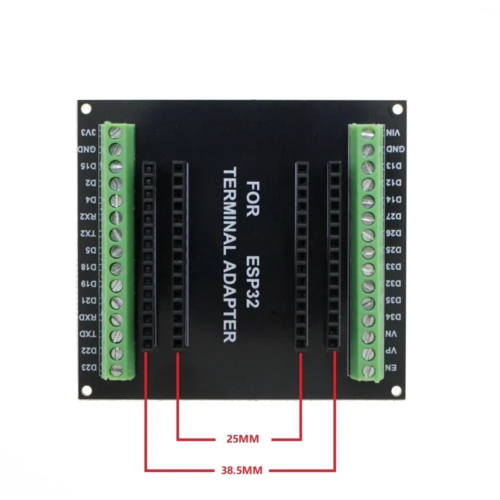
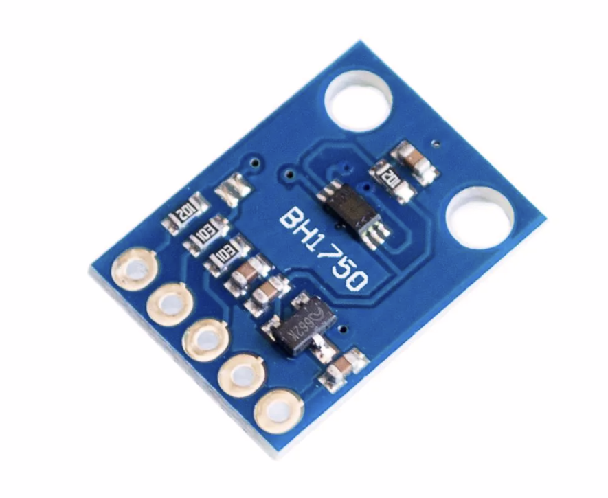
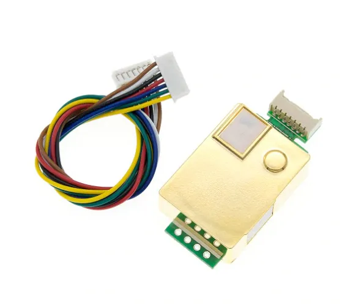
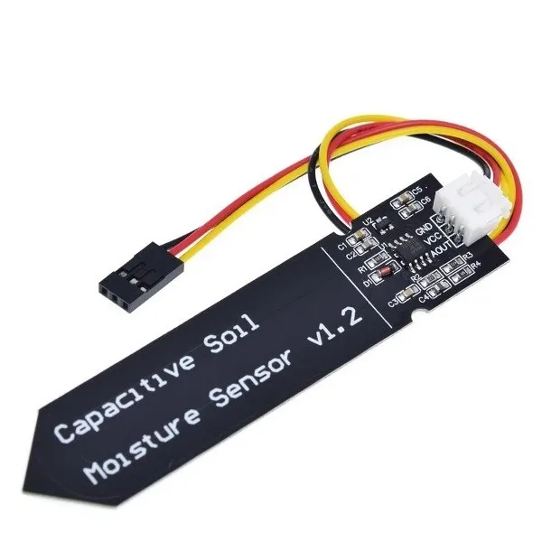
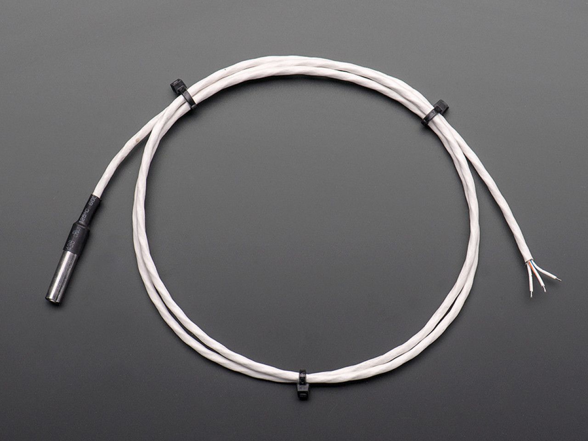
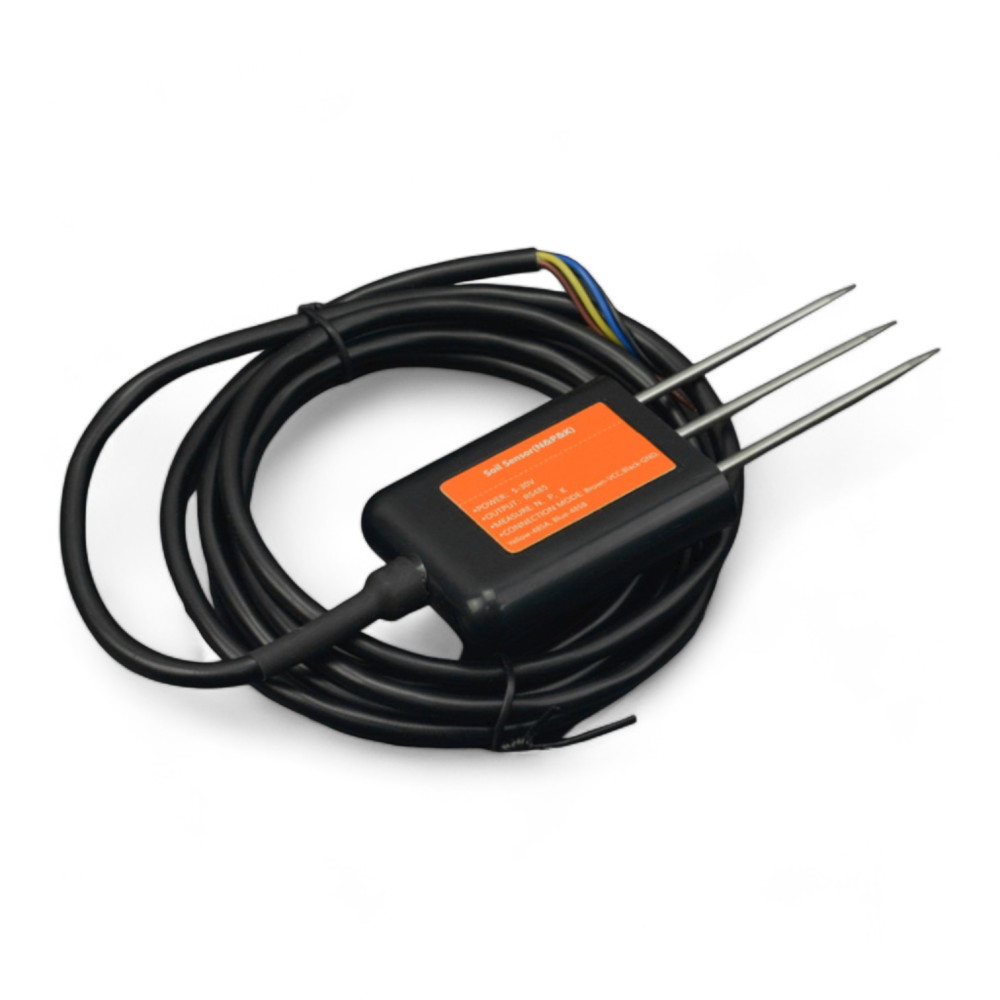
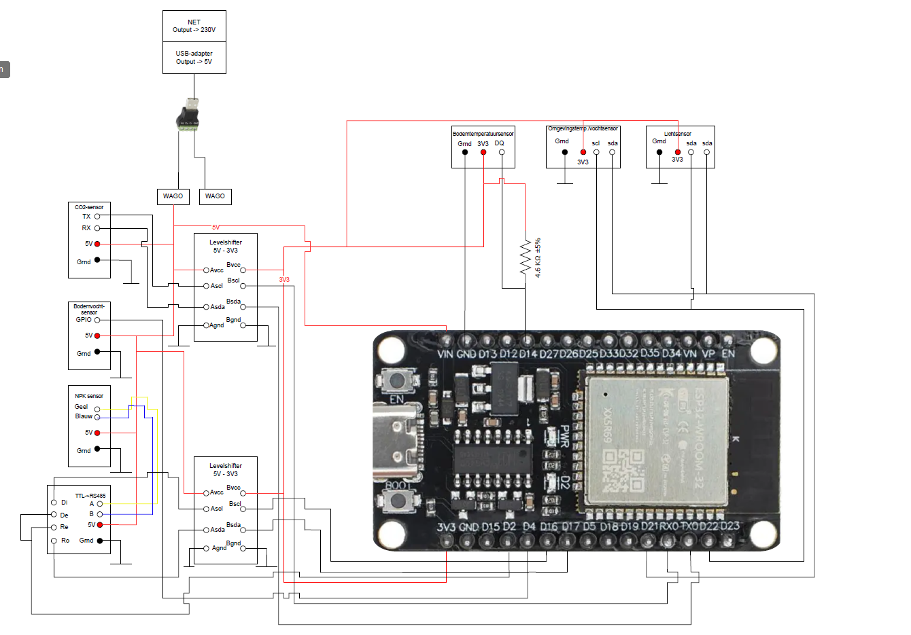

# Architectuur:
De **ESP32 Devkit V1** board wordt gebruikt als microcontroller voor de aansturing. De ESP zal in een 3D-geprinte behuizing geplaatst worden en verbonden worden aan een speciale adapter om kabels eenvoudiger te kunnen bevestigen.

# ESP32
De minimale stroomvoorziening voor de ESP32 is 500 mA.

# Sensoren
De volgende 6 sensoren worden gebruikt voor het monitoren van de planten:

## Temperatuur- en vochtsensor omgeving

- **Beschrijving:** Deze sensor (Temperatuur/Vochtigheid Sensor Module Breakout - HTU21D (OT3567)) meet zowel de temperatuur als de luchtvochtigheid in de omgeving van de serre. Hiervoor zal een klein doosje geprint worden om deze veilig op te bergen.
- **Elektrische eigenschappen:** Gevoed op 3.3V, direct via de ESP. Stroomverbruik ligt tussen 300 en 500 µA in actieve toestand (tussen 0.02 en 0.14 µA in slaapstand).
- **Overig:** Heeft SCL/SDA-pinnen die rechtstreeks op pin D21 en D22 van de ESP aangesloten kunnen worden. Een andere sensor (lichtsensor) gebruikt ook SCL/SDA, maar beide sensoren hebben een ander I2C-adres, wat geen probleem oplevert. Deze sensor werkt op adres **0x40**.
- **Bronnen:**
  - [Verkooppagina Otronic](https://www.otronic.nl/nl/temperatuur-vochtigheid-sensor-module-breakout-htu.html)

## Lichtintensiteitsensor

- **Beschrijving:** Deze sensor meet de lichtsterkte in de serre en zal op enige afstand van de ESP bevestigd worden in een 3D-geprint doosje. Deze sensor werkt via I2C en heeft twee mogelijke adressen: **0x5C** (als ADDR hoog is) of **0x23** (als ADDR laag is).
- **Elektrische eigenschappen:** Werkt bij een spanning tussen 3V en 5V.
- **Bronnen:**
   - [Verkooppagina Otronic](https://www.otronic.nl/nl/lichtintensiteitssensor-bh1750-16-bit-i2c.html)
  - [Voorbeeldcode met Arduino](https://randomnerdtutorials.com/guide-for-ds18b20-temperature-sensor-with-arduino/)
  - [Instructables Tutorial](https://www.instructables.com/How-to-use-DS18B20-Temperature-Sensor-Arduino-Tuto/)

## Co² sensor

- **Beschrijving:** Deze sensor meet de kwaliteit van de lucht (Co² en stikstof). Dit zal in een doosje in een doosje zitten met gaten zodat deze nog goed kan meten. Signalen worden verstuurd door TX en RX uitgang. 
- **Elektrische eigenschappen:** Werkt bij een voeding van 4.5-5.5V DC.
- **Bronnen:**
  - [Verkooppagina Otronic](https://www.otronic.nl/nl/co2-sensor-mh-z19b-met-kabeltje.html)

## Bodemvochtsensor

- **Beschrijving:** Deze sensor zal de vochtigheid meten van onze grond. Deze wordt gevoed met 5V voeding. Met een signaalkabel worden de gegevens naar de esp gezonden.
- **Elektrische eigenschappen:** Deze sensor werkt op 5V.
- **Bronnen:**
  - [Verkooppagina Otronic](https://www.otronic.nl/nl/bodemvochtsensor-met-voltage-regulator-copy.html)

## Bodemtemperatuursensor

- **Beschrijving:** Dit is een Bodemtemparatuursensor en zal in de grond zitten. Waar het de temperatuur zal meten, dit wordt doorgestuurd met een signaal kabel naar de esp.
- **Elektrische eigenschappen:** Werkbaar bij een spanning tussen 3.0V en 5.5V.
- **Overige:** Werkt tussen de -55 en 125 graden.
- **Bronnen:**
  - [Verkooppagina Kiwi Electronics](https://www.kiwi-electronics.com/nl/hoge-temp--waterbestendige-ds18b20-digitale-temperatuursensor-plus-weerstand-1431?country=BE&srsltid=AfmBOoqwPQA5-UhEoJuMfzhCg9EEue8CdF8_Cq9gSyED76mqtEb_zfaPs80)

## Voedingstofsensor

- **Beschrijving:** De voedingstofsensor ookwel NPK sensor genoemd meet drie dingen uit. De stikstof, de fosfor en de kalium. Dit kan niet rechtstreeks uitgemeten worden op de esp, hiertussen moet je een TTL -> RS485 plaatsen. Om een goed signaal te kunnen krijgen op de esp.
- **Elektrische eigenschappen:** Deze sensor werkt tussen de  5V en 30V.
- **Overige:** Maximum temperatuur is 80°C.
- **Bronnen:** 
  - [Verkooppagina Mouser](https://www.mouser.be/ProductDetail/DFRobot/SEN0605?qs=sGAEpiMZZMu3sxpa5v1qrmro%252BbykgF%2FHBGnWfOZZDls%3D)
  - [Aansluitschema's](https://how2electronics.com/iot-based-soil-nutrient-monitoring-with-arduino-esp32/#:~:text=So,%20this%20is%20how%20you%20can%20make%20a)

# Schema van de aansluitingen
